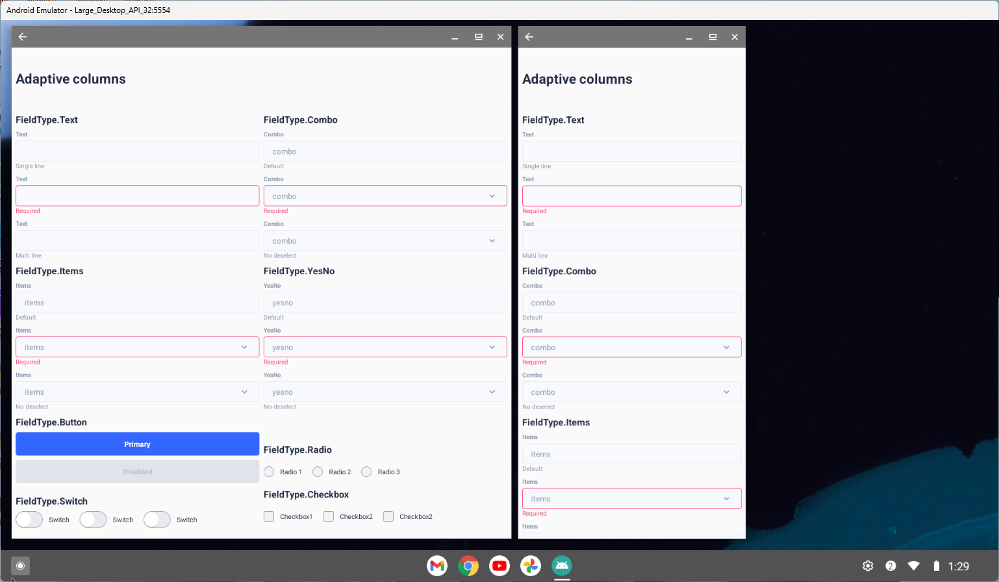
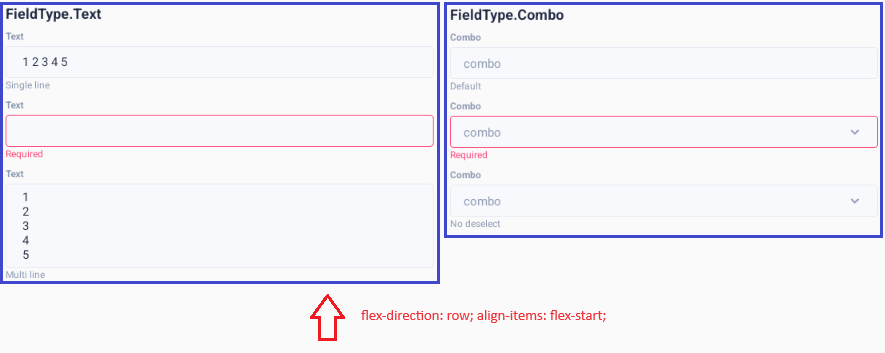
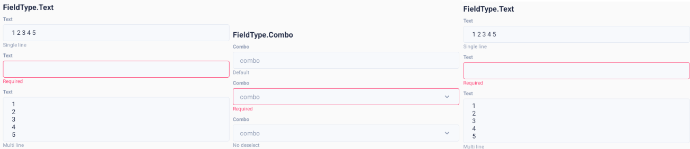
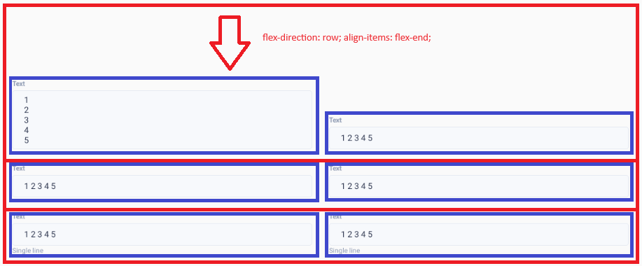
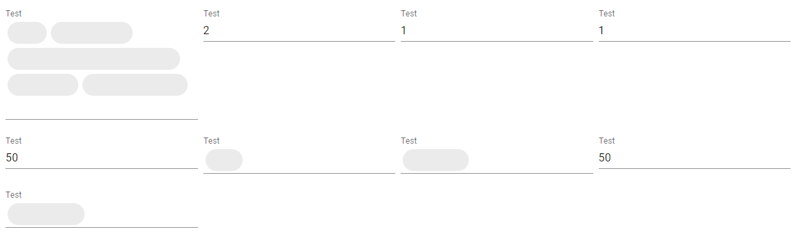

# Адаптивная верстка на React Native

> Описание проблем, возникших при портировании классического React приложения в React Native можно прочитать в этой статье. Речь идет о поддержке различных форм факторов устройств, в том числе, Galaxy Fold

## Проблема

Некоторое время назад начал разработку мобильного приложения на React Native. Проблема в том, что требованием к приложению является Galaxy Fold и Samsung DeX


Как следствие, встал вопрос реализации адаптивной верстки форм.Одно и тоже приложение должно рисовать формы в одну колонку в режиме телефона и две колонки в режиме планшета. Если писать разный код компоновок, придется дублировать логику форм, как минимум, новое поле добавляется два раза.



Yoga Layout, движок верстки из React Native, поддерживает только flexbox. В результате, грамотно реализовать верстку, избегая излишней вложенности View, является нетривиальной задачей: вложенные группы должны отображаться от верхнего края родителя, поля ввода должны равняться на нижний край строки отображения (baseline)



Если принебречь правилом привязки групп полей к верхнему краю, получится уродство



Поля внутри группы должны быть привязаны к нижнему краю строки



Уродство при верхнем baseline для полей не очевидно с первого взгляда, но очень бросается при использование standard полей из Material 1 на Android 4



## Решение проблемы

Для того, чтобы делегировать сложную задачу грамотной компоновки форм более дешевому специалисту, был разработан шаблонизатор, генерирующий верстку по указанным выше правилам из JSON шаблона. Пример шаблона в блоке кода ниже

```tsx
import { One, FieldType, TypedField } from 'rn-declarative';

import { Text } from '@ui-kitten/components';
import { ScrollView } from 'react-native';

const fields: TypedField[] = [
    {
        type: FieldType.Component,
        style: {
            justifyContent: 'center',
            width: '100%',
            height: 125,
        },
        element: () => (
            <Text category='h4'>
                Adaptive columns
            </Text>
        ),
    },
    {
        type: FieldType.Group,
        style: {
            width: '100%',
        },
        fields: [
            {
                type: FieldType.Group,
                phoneStyle: {
                    width: '100%',
                },
                tabletStyle: {
                    width: '50%',
                },
                desktopStyle: {
                    width: '25%',
                },
                fields: [
                    {
                        type: FieldType.Component,
                        style: {
                            width: '100%',
                        },
                        element: () => (
                            <Text category='h6'>
                                FieldType.Text
                            </Text>
                        ),
                    },
                    {
                        type: FieldType.Text,
                        style: {
                            width: '100%',
                        },
                        name: 'text',
                        title: 'Text',
                        description: 'Single line',
                    },
                    {
                        type: FieldType.Text,
                        style: {
                            width: '100%',
                        },
                        validation: {
                            required: true,
                        },
                        dirty: true,
                        name: 'text_invalid',
                        title: 'Text',
                        description: 'Invalid',
                    },
                    {
                        type: FieldType.Text,
                        style: {
                            width: '100%',
                        },
                        inputMultiline: true,
                        name: 'text',
                        title: 'Text',
                        description: 'Multi line',
                    },
                ],
            },

            ...

];

export const MainPage = () => {
    return (
        <ScrollView>
            <One fields={fields} onChange={console.log} />
        </ScrollView>
    );
};

export default MainPage;
```

Библиотека разделена на два модуля: [rn-declarative](https://www.npmjs.com/package/rn-declarative) и [rn-declarative-eva](https://www.npmjs.com/package/rn-declarative-eva). Первая содержит базовую логику и не зависит от UI kit: может быть установлена в любом проекте не зависимо от версии `react-native` или фреймворка (поддерживается как `Expo`, так и starter kit от `react-native-community`). Кроме `react` и `react-native` других зависимостей нет.

```tsx
import { useMediaContext } from 'rn-declarative'

...

const { isPhone, isTablet, isDesktop } = useMediaContext();
```

Настройка ширины компоновок и полей осуществляется через свойства объектов `phoneStyle`, `tabletStyle` и `desktopStyle`. Если не хотим менять стиль исходя из форм-фактора устройства, можно написать просто `style`. Подключение UI Kit осуществляется через контекст с слотами `<OneSlotFactory />` для подключения реализации `FieldType`.

```tsx
import { Toggle } from '@ui-kitten/components';
import { OneSlotFactory, ISwitchSlot } from 'rn-declarative';

export const Switch = ({
  disabled,
  value,
  onChange,
  onFocus,
  onBlur,
  title,
}: ISwitchSlot) => {
  return (
    <Toggle
      checked={Boolean(value)}
      disabled={disabled}
      onChange={() => onChange(!value)}
      onFocus={onFocus}
      onBlur={onBlur}
    >
      {title}  
    </Toggle>
  );
};

...

const defaultSlots = {
    CheckBox,
    Combo,
    Items,
    Radio,
    Button,
    Text,
    Switch,
    YesNo,
};

...

<OneSlotFactory
    {...defaultSlots}
>
    {children}
</OneSlotFactory>
```

P.S. Любой другой компонент или пользовательскую верстку можно прозрачно интегрировать через `FieldType.Component` (есть `onChange` и `value`) или `FieldType.Layout`

```tsx
{
  type: FieldType.Component,
  element: () => (
      <Text category='h4'>
          Sample component
      </Text>
  ),
},

...

{
  type: FieldType.Layout,
  customLayout: ({ children }) => (
      <ScrollView>
          {children}
      </ScrollView>
  ),
},
```

Код компонента опубликован на Github, посмотреть можно по ссылке:
[https://github.com/react-declarative/rn-declarative/](https://github.com/react-declarative/rn-declarative/)

Спасибо за внимание!
